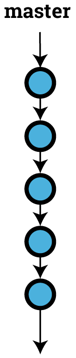
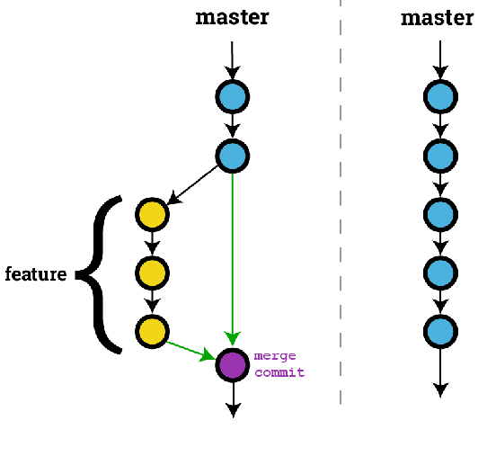

## Feedback/Questions from Part 1
- no more R/RStudio (terminal!)
- focus less on _how_ and more on _why_
- more realistic examples
- what about Word files?
- anything else?

## Part 1 Recap
- git & github are best suited for text files
    - `.txt`, `.csv`, `.do`, `.sas`, `.md`, `.py` etc.
    - anything you can open in a boring text editor (e.g. notepad)
- important terminology:
    - `repository`: a project in git
    - `commit`: a snapshot of the state of a repository
    - `branch`: a string of commits
- very efficient; commits only contain _changes_
- great for analysis scripts, manuscripts, and data files
- git & github give you history, centralization, and delegation of tasks
- **SO** much better than emailing files around and appending numbers to file names!

## What's New In Part 2?
- issues, branches, and pull requests
- demonstrate real, collaborative workflows with the help of my beautiful assistant, Andrew

# (demo)

## Naive Workflow: Master-only
- this is what we did last time!
- example: we have a file (`.sas`, `.R`, `.py`, etc.) with analysis/processing code for a new project
    - want to track & document changes over time
    - history is centralized (on Github)
    - anyone can easily access your project (if you want them to)
- steps:
    1. Make some changes, save, then `git commit` (making a package)
    2. `git push` to send your _local_ commits to the _remote_ repository (sending one or more packages)
    3. See the commit(s) on Github
    
## Naive Workflow: Visualized

# (demo)

## Naive Workflow: Pros/Cons
- pros:
    - it's easy!
    - suitable for single-person projects
    - still get lots of benefits like history, centralization, issues, etc.
    - every project starts this way
- cons:
    - gets messy with more than one person
    - no separation of work

## Naive Workflow: Conflicts!
- have you ever had someone mess up your work (delete a file, overwrite something important, etc.)?
    - this is why we tend to email copies of our work (so we can go back to the original files, a certain _state_ of the project)
    - :( :( :(
    
# (demo)

## Naive Workflow: Solving Conflicts
- solution: issues, branches and pull requests!
    - `issues` specify what needs to be done
    - doing work on non-`master` branches allows for review between collaborators
    - Github calls these reviews `pull requests`
        - PR's bring commits from one branch into another

## A Tissue for your Issue
- we can use github _issues_ to track what needs to be done
- discuss, categorize, assign (built-in project management)
- reference these issues in your commit messages to make it clear what's being done
- example: there's a bad label in our (overly-simply) data file
   - Andrew can make an issue, assign it to me, and then I'll fix it

# (demo)

## Collaborative Workflow: Issues and Branches and Pull Requests, Oh My!
- having work on non-`master` branches gives collaborators a chance to review
- only let _good stuff_ go into `master`
- steps:
    1. make an issue
    2. create a _feature_ branch
    3. fix the issue with commit(s) on that branch
    4. push that branch with those commit(s)
    5. file a Pull Request to merge the branch into `master`

## Collaborative Workflow: Visualized

# (demo)

## First Steps
- easiest method is to start a new repo from Github (and then `git clone` it)
- `git clone` can also get a local copy of someone else's repo
- will need permissions to `git push` any commits to someone else's
- you can also `fork` (on Github) to copy the repo to _your_ account (then clone)
    - you can file a pull request to ask the owner to incorporate your changes

# Questions?

## Resources
- find this presentation on github: [SSW-DataLabt/Workshops](https://github.com/SSW-DataLab/Workshops)
- intro from Github: [Try Git](https://try.github.io)
- gamified git! [Learn Git Branching](https://pcottle.github.io/learnGitBranching/)
