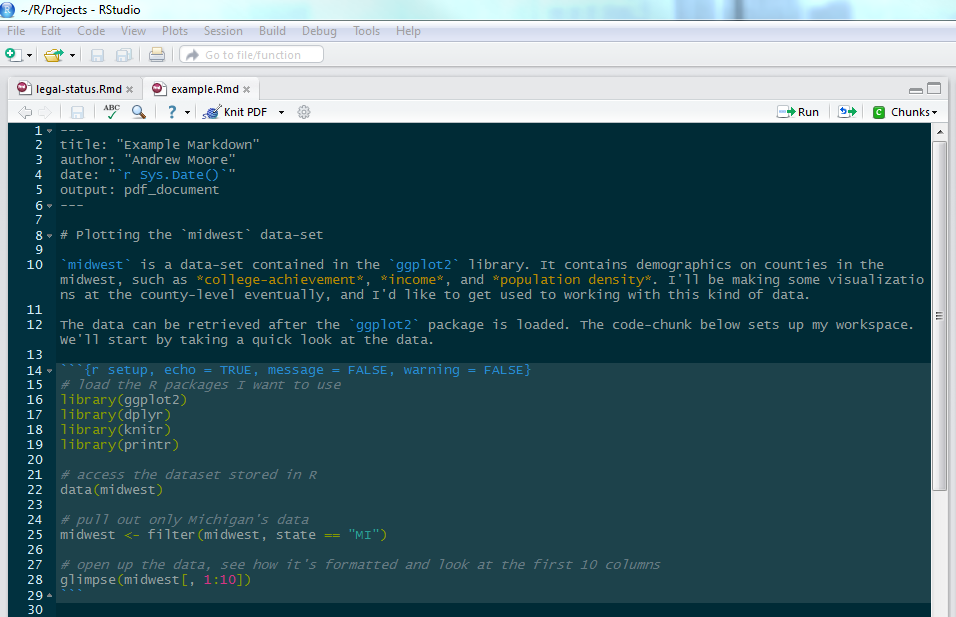
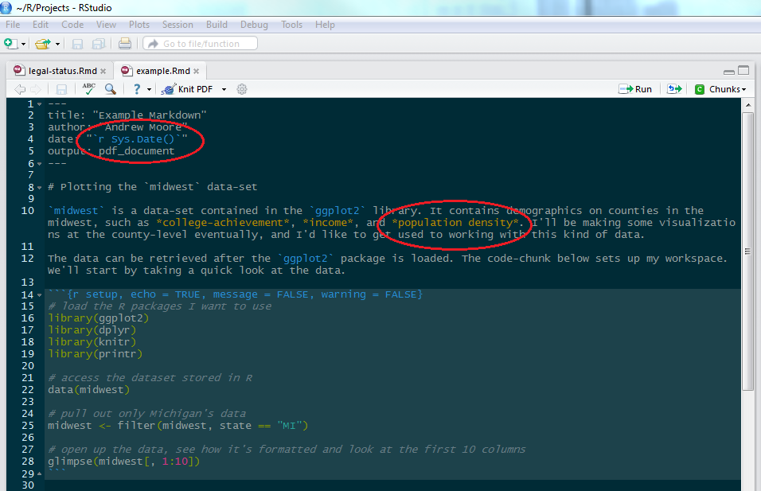
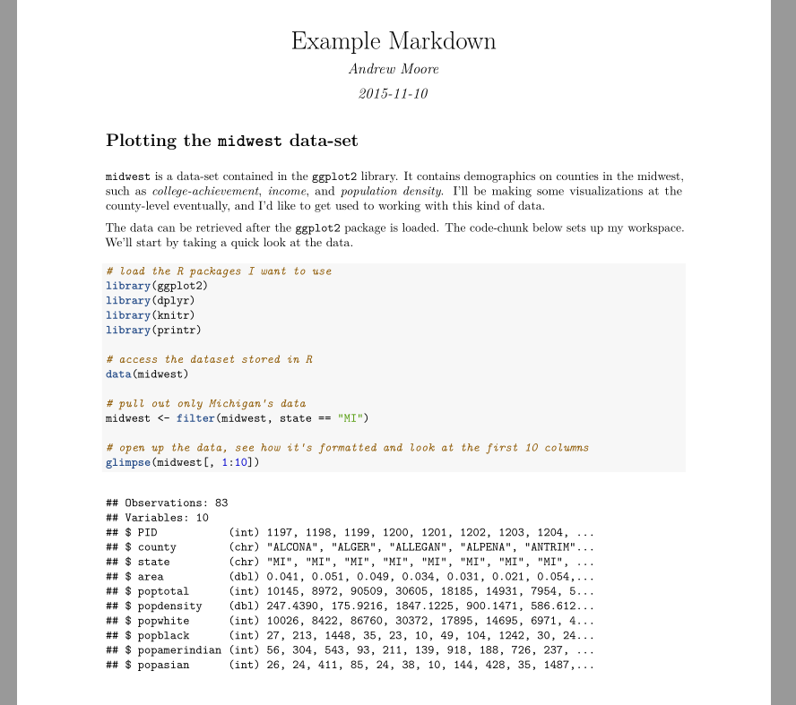
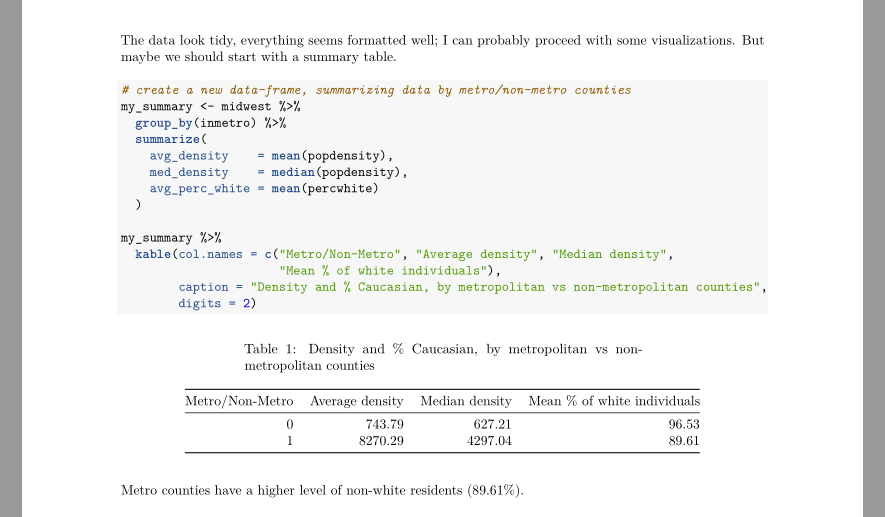

```{r, include = FALSE, echo = FALSE}
# mypresentation.html?presentme=true

# add notes in slides with:
# <div class="notes">
# Note
# Note
# Note
# </div>

# ---- AM's Notes ----
# Lacour study

# It can be useful to people who don't use R
# great for other languages, eg. python
# ```{r} versus ```{python}
# can be used with SAS!
# PSID data can be set up in a chunk, and then R can take care of the rest.
# Any variables made in a SAS chunk would have to be saved to disc :(
# But, code can read in the files if necessary

# have an abstract for monday before
# not an all-encompassing solution
# but...
# excellent for a dissertation & internal consistency

# reproducibility important for lots of work, but also for yourself
# keep track of things, with version control!
# don't save output!

# literate programming
# text and code all in one place, logical order
# data automatically updated to reflect external changes
# you test your code each time you knit/save the document
# 

# this comic is helpful http://www.phdcomics.com/comics/archive.php?comicid=1531

```

## Review & (brief) Outline

- Git/GitHub
- New questions?
- Collaborative tools to *centralize* your workflow.

- Extend on these concepts, as they relate to concepts in reproducibility
- Similar mindset as last-time: provide an overview, help demonstrate options that have
been highly useful in our work.

## What is Reproducibility?

<div class="notes">
- Lots of government and public data being produced and shared
- Increased access and demand means there are more eyes looking at the same stuff
- Varying levels of ability and expertise lead to potentially non-reproducible work
- Best way to ensure good quality is through good documenation, and control of materials
</div>

"Reproducible research is the idea that data analyses, and more generally, scientific claims, are published with their data and software code so that others may verify the findings and build upon them." 
  -- [JHDS Reproducible Research Course](https://www.coursera.org/course/repdata)

 - Open Science

 - Good habits

## Who cares? | Essential tasks for researchers

<div class="notes">
- Reproducibility is being able to fully recreate another individual's analysis on your local system.
- This makes it necessary to share both analytic code and data
- Infeasible for certain types of research
- DataLab can't share data-- too sensitive, major concerns with privacy for individuals involved
- But we benefit internally from good documentation and building in reproducibility between analysts
- Each individual working with the data should be able to step into an analysis file or processing file, and be able to contribute as necessary
</div>

- Good standards for scientific research
- But... Difficult to maintain if you work with sensitive data
- Perspective is valuable

## 3 Essential Tasks for Researchers

1. Data Analysis
    + Diving deep
    + Analysis scripts? Syntax? Output files?
    + **Extract results, in order to interpret findings**
2. Documentation/Description
    + Create methods/results/discussion
    + **Arrange statistics, tables, figures into report** (or manuscript, .docx, etc.)
3. Sharing with colleagues/community
    + Forward manuscript to collaborators
    + Receive comments & feedback
    + **Exchanging information in order to iterate**
    + Repeat #1 & #2

## You already know this stuff | Why R and R-Markdown?

<div class="notes">
- R is great for almost any type of data analysis you can think of
- If you've heard of it, there's probably a package for it
- Can be used to build things, in addition to just data-analysis
- Great tools being created for scientists
- But a major reason to use RMarkdown specifically, is because it helps you collapse some of these three essential tasks
- It's not a panacea
- You may shift back to word or some other editor, or even analysis software from time to time
- But using Markdown in this way requires you to approach the three tasks a little differently
</div>

- **Do I have to use R?**
    - (yes)
    - But there's some support for other languages! 
    - (python & SAS, more on this later)

- Widely used, deep knowledge-base, open-source
- Great tools being developed with scientists in mind (like `ggplot2` & R-Markdown!)<br>

- **Collapse the three essential tasks**
- Not a fix-all for everything

## R-Markdown as literate statistical programming

<div class="notes">
- literate programming needs:
    + a documentation language
    + a programming language(s)
- knitr is developed by Yihui Xie
- allows you to develop both the necessary explanatory text, while simultaneously developing analytic code that ultimately displays your results.
- Scientific manuscripts already set-up to be "recipes" for a research project-- at least with (methods, results)
- Working with your text and code this way allows you to have a smaller distance between them
- Thus, fewer switch costs! Keep your flow!
- The important element is recording your work, and summarizing it-- no need to switch between editors.
</div>

- Processing/Analysis code & reporting done together.
- Original concept from [Don Knuth](https://en.wikipedia.org/wiki/Donald_Knuth)
- An article is a stream of **text** and **code**
- Article text explains what you're doing, rationale for analysis, steps taking place
- Code "chunks" are executed sequentially to perform (& reproduce) the analysis.

## R-Markdown as literate statistical programming
<div class="notes">
- nitty gritty
- may not be useful to all audience members
- emphasize what it solves
</div>

- **Clean session**
    - Results are genereated anew, each time the report is generated
    - Caching is possible for computationally expensive steps

- **In-line** code
    - No need to make numbers derived from data hard-written

```{r eval = FALSE}
There are `r nrow(my_data)` individuals.
The estimated correlation between x and y was `r cor(x, y)`.
```

## R-Markdown as literate statistical programming



## R-Markdown as literate statistical programming



## R-Markdown as literate statistical programming



## R-Markdown as literate statistical programming



## Analyses/Manuscripts as "Recipes"

- Reproducibility an important subject overall, but has benefits even for those who work with sensitive files
- Good code/syntax allows you to reconstruct an analysis for yourself
- Storing local figures, data, summaries is a lot of cognitive overhead
- Markdown files encompass a product/report from start-to-finish
- Figures/tables are embedded in the output-- no need to have a file of figures.